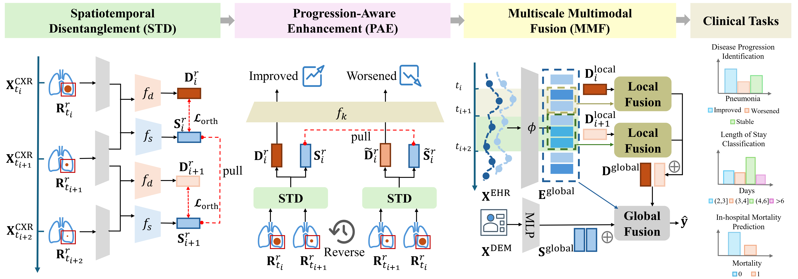

# Multimodal Disease Progression Modeling via Spatiotemporal Disentanglement and Multiscale Alignment

[](https://arxiv.org/abs/2510.11112)
[](LICENSE)


> **Official Implementation of [DiPro (NeurIPS 2025 Spotlight, acceptance rate 3.1%)](https://arxiv.org/abs/2510.11112)**  
> _A framework for modeling disease progression from multimodal, longitudinal EHR and CXR._

---

## 📖 Abstract

Longitudinal multimodal data — such as **electronic health records (EHR)** and **sequential chest X-rays (CXRs)** — are critical for modeling disease progression but remain underutilized due to two challenges:  
1. **Redundancy** in consecutive CXRs, where static anatomical structures overshadow dynamic pathological changes.  
2. **Temporal misalignment** between irregular imaging and continuous EHR data.  

We propose **DiPro**, a novel framework addressing these issues through **region-aware disentanglement** and **multiscale temporal alignment**.  

- 🧩 **Disentanglement**: Separates static (anatomy) and dynamic (disease) CXR features to highlight progression-relevant changes.  
- 🧬 **Multiscale alignment**: Integrates dynamic imaging and asynchronous EHR signals at both local (interval-level) and global (sequence-level) timescales.  

Extensive experiments on the **MIMIC-CXR + EHR** dataset demonstrate that DiPro effectively captures temporal clinical dynamics and achieves state-of-the-art performance on both disease progression identification and general ICU prediction tasks.

---

## 🚀 Overview of DiPro



**🌟 Framework Highlights:**
1. **🧩 Spatiotemporal Disentanglement (STD)**  
   Separates dynamic pathological features from static anatomical structures across time.  

2. **🔄 Progression-Aware Enhancement (PAE)**  
   Improves understanding of progression direction by reversing CXR pairs — enforcing reversed dynamics while keeping static consistency.  

3. **🔗 Multiscale Multimodal Fusion (MMF)**  
   Aligns CXR features with asynchronously sampled EHR data at both interval and sequence levels, enabling robust multimodal prediction across tasks such as:
   - Disease progression identification  
   - Length-of-stay prediction  
   - In-hospital mortality classification  

---

## ⚙️ Environment Setup

```bash
# 1️⃣ Create and activate environment
conda create -n dipro python=3.8
conda activate dipro

# 2️⃣ Install PyTorch (CUDA 11.1)
pip install torch==1.9.1+cu111 torchvision==0.10.1+cu111 -f https://download.pytorch.org/whl/torch_stable.html

# 3️⃣ Install dependencies
pip install -r requirements.txt
pip install taming-transformers-rom1504
```
## 🧾 Data Preparation
1. Download the [MIMIC-CXR-JPG (v2.0.0)](https://physionet.org/content/mimic-cxr-jpg/2.0.0/) for longitudinal CXR,  [MIMIC-IV (v2.0)](https://physionet.org/content/mimiciv/2.0/) for EHR and [Chest-ImaGenome (v1.0.0)](https://physionet.org/content/chest-imagenome/1.0.0/) for CXR anatomical bounding box, disease progression labels. 

2. Define all dataset and file paths in [`scripts/data_source.sh`](scripts/data_source.sh), according to the detailed instructions and examples within the script.


3. Prepare processed inputs:
   ```bash
   cd DiPro/
   bash scripts/data_preparation.sh
   ```

4. After running the data preparation scripts, your `$processed_data_dir` will have the following directory structure:

    ```bash
    $processed_data_dir
    ├── disease_progressions/      # Organized by disease; each folder contains CXR pairs representing disease progression extracted from Chest-ImaGenome
    ├── original_ehr/              # Raw EHR data, organized per patient (patient_id) and per hospital stay (stay_id)
    ├── ehr_preprocessed/          # Preprocessed EHR data (resampled, imputed, and normalized)
    ├── split/                     # Train, validation, and test splits for each task, including the extracted labels
    ├── cxr_bbox.csv               # Bounding box coordinates for each CXR anatomical region
    └── demographic_processed.csv  # Preprocessed demographic data (discretized and normalized)
    ```

    > ℹ️ Note: Other intermediate files required for generating the final input data are also stored in this directory. Details on how these files are created can be found in the corresponding implementation scripts.

## 🧪 Experiments

### ✅ Test with Pretrained Checkpoints

Download pretrained models from [🤗 Hugging Face: DiPro_model](https://huggingface.co/Chenhihihi/DiPro_model).  
Then set paths in `scripts/data_source.sh` and run:

```bash
task_name=disease_progression   # [disease_progression, mortality, length_of_stay]
DiPro_model_dir=~/DiPro_model   # path to the downloaded model
Run_name=test # Assign a name to this run for better experiment tracking and logging
gpu=0 # Specify the gpu id
bash scripts/test.sh $task_name $DiPro_model_dir $Run_name $gpu
```

Results will be reported as **mean ± std** across three random seeds.

---

### 🏋️‍♂️ Train and Evaluate from Scratch

To train DiPro on three random seeds and report averaged results:

```bash
task_name=disease_progression   # or mortality / length_of_stay
Run_name=train_from_scratch  # Assign a name to this run for better experiment tracking and logging
gpu=0 # Specify the gpu id
bash scripts/experiment.sh $task_name $Run_name $gpu
```

Logs and checkpoints are saved under:

```bash
./logs/$Run_name/$task_name/[timestamp]_seed$seed/
```

Each run contains:
- `total_metrics.csv/json` — evaluation metrics  
- `checkpoints/` — model weights  

> ⚠️ *Experiments were conducted on an RTX 3090 (24GB) GPU and Intel Xeon Gold 6330 (14 vCPU).* Slight numerical variations may occur when using different hardware(CPU, GUP) or PyTorch/cuDNN versions.

---

## 📚 Citation

If you find this repository useful, please consider citing:

```bibtex
@article{liu2025multimodal,
  title   = {Multimodal Disease Progression Modeling via Spatiotemporal Disentanglement and Multiscale Alignment},
  author  = {Liu, Chen and Yao, Wenfang and Yin, Kejing and Cheung, William K and Qin, Jing},
  journal={Advances in Neural Information Processing Systems},
  year    = {2025}
}
```

---

## ❤️ Acknowledgements

We gratefully build upon and acknowledge the following open-source projects:

- [**MedFuse**](https://github.com/nyuad-cai/MedFuse) and [**mimic3-benchmarks**](https://github.com/YerevaNN/mimic3-benchmarks/) — EHR extraction & preprocessing codebase  
- [**SDPL**](https://github.com/zhuye98/SDPL/tree/master) — Chest-ImaGenome preprocessing  
- [**Latent Diffusion**](https://github.com/CompVis/latent-diffusion) — PyTorch Lightning framework reference  
